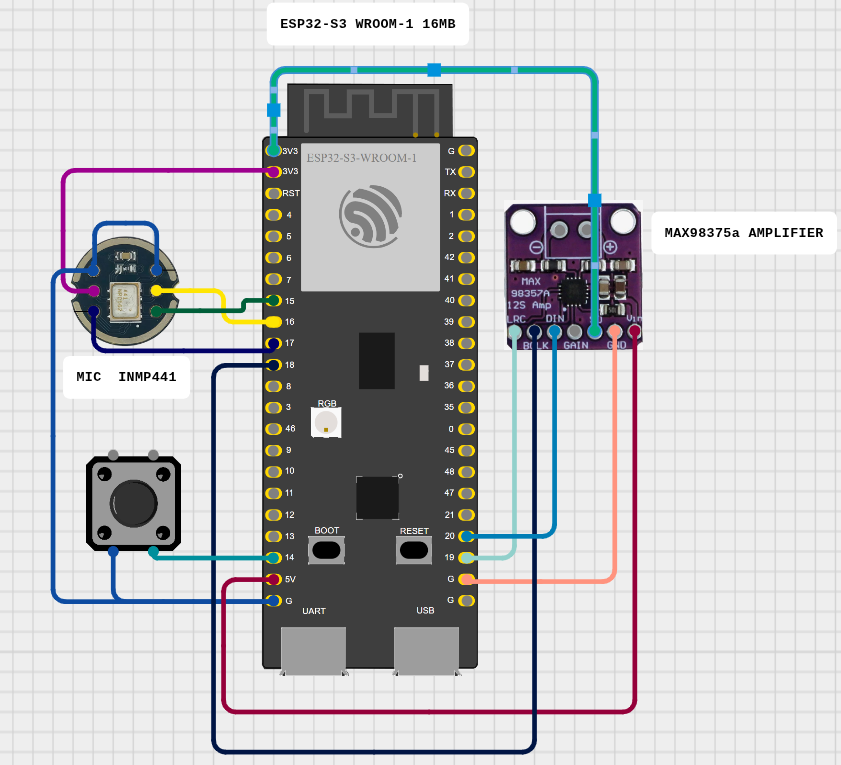

# ESP32-S3 I²S Recorder / Player


This project—used as a test for the Goiaba platform—shows how to record audio from an **INMP441** MEMS microphone and play it back through a **MAX98357A** Class‑D amplifier using an **ESP32‑S3 DevKitC‑1**.
A single push‑button starts/stops recording; the on‑board LED indicates status.



## Hardware Used

| Item   | Details                                                           |
|--------|-------------------------------------------------------------------|
| MCU    | ESP32‑S3 DevKitC‑1 (module **ESP32‑S3‑WROOM‑1‑N16**, 16 MB Flash) |
| Mic    | INMP441 I²S MEMS microphone breakout                              |
| Amp    | MAX98357A I²S 3 W audio amplifier breakout                        |
| Control| Momentary push‑button (GPIO14 → GND)                              |
| LED    | On‑board RGB LED (GPIO38)                                         |

## Wiring

| Function     | ESP32‑S3 GPIO | INMP441 | MAX98357A | Notes                                |
|--------------|---------------|---------|-----------|--------------------------------------|
| 3.3 V        | 3V3           | VIN     | VIN       | Common supply                        |
| GND          | GND           | GND     | GND       | Common ground                        |
| **BCLK Rx**  | **15**        | SCK     | –         | Mic bit‑clock                        |
| **WS Rx**    | **16**        | WS/LR   | –         | Mic word‑select                      |
| **DATA IN**  | **17**        | SD      | –         | Mic → MCU                            |
| **BCLK Tx**  | **18**        | –       | BCLK      | Amp bit‑clock                        |
| **WS Tx**    | **19**        | –       | LRC       | Amp word‑select                      |
| **DATA OUT** | **20**        | –       | DIN       | MCU → Amp                            |
| L/R Select   | —             | L/R→GND | –         | Mono (Left)                          |
| Enable (SD)  | —             | –       | SD/EN→3V3 | Amp always on                        |
| Gain         | —             | –       | GAIN→3V3 / GND / float | 12 dB / 6 dB / 9 dB |
| Button       | **14**        | –       | –         | Between GPIO14 & GND (INPUT_PULLUP)  |
| LED          | **38**        | –       | –         | Built‑in LED                         |


### Key Libraries / Headers

* **ESP‑IDF HAL** (`driver/i2s.h`) – I²S peripheral access.
* `esp_heap_caps.h` – heap‑capable SRAM allocation.

## Runtime Parameters (default)

* `SAMPLE_RATE` = 16000 Hz
* `REC_SECONDS` = 10 s (→ 64 kB buffer in internal SRAM)

> Using a module **with PSRAM** (e.g. ESP32‑S3‑WROOM‑1‑N8R8) you can raise both values (10 s @ 16 kHz ≈ 320 kB).

In your project root, run `make menuconfig` and navigate to **Component config → ESP PSRAM → Support for external, SPI-RAM** (enable it!). There you’ll find the "PSRAM Type" setting—change it from the default Quad-SPI to **Octo-SPI**. Once enabled, save and exit; the build system will automatically configure the Octo-SPI driver so you can take full advantage of your 8 MB PSRAM for high-bandwidth audio buffering.

## Quick Start

```bash
# 1. (Once) Set up environment
make setup

# 2. Build firmware
make build

# 3. Flash to device
make flash

# 4. Monitor UART (115200 baud)
make monitor
```

Press **Ctrl+]** to exit the serial monitor.

## Behaviour Flow

1. **IDLE** – LED off, waiting for button.
2. **RECORD** – LED on, capture until 4 s or second press.
3. **Delay** – 1 s pause.
4. **PLAYBACK** – LED off, buffer sent to amp.
5. Loop back to **IDLE**.

## License

MIT © 2025
